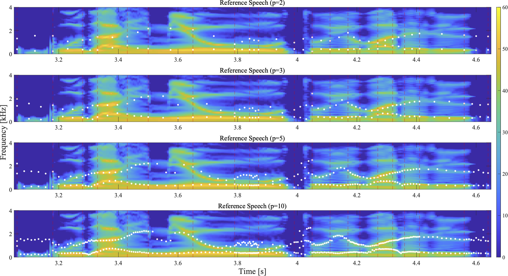
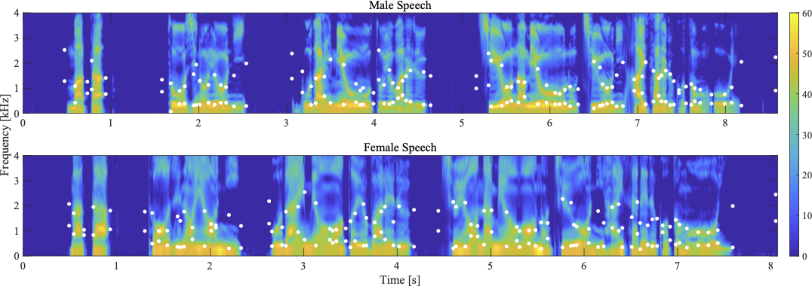

明治大学[森勢研究室](http://www.isc.meiji.ac.jp/~mmorise/lab/)にて[堀部貴紀](https://takanohori.github.io/)が行っている音声モーフィングの研究についてまとめています．

## 音声モーフィングにおける自動対応付けの提案と品質評価
**堀部貴紀**, 森勢将雅, 日本音響学会2024年春季研究発表会 (発表日：2024/03/07).

### アブストラクト
- 音声モーフィングにおける時間軸方向の対応付け**動的時間伸縮（Dynamic Time Warping）**と短時間パワーを用いた手法を提案する．
- 主観評価の結果，手動による対応付け，提案手法，音素境界による従来手法の順に自然性が高いと判断された．
  - 特に，従来手法との間に有意差が認められたことから，提案手法は対応付け手法として有効であるといえる．

<table>
<tbody align="center" width="40%">
    <tr>
        <td></td>
        <td><b>提案手法</b></td>
        <td><b>手動による対応付け</b></td>
        <td><b>従来手法</b></td>
    </tr>
    <tr>
        <td><b>FF</b></td>
        <td><audio src="data/asj2024s/morphRefjvs040Tarjvs082Tx010D20231109T200628d.wav" controls></audio></td>
        <td><audio src="data/asj2022a/m_jvs040vs082_t010.wav" controls></audio></td>
        <td><audio src="data/asj2022a/a_jvs040vs082_t010.wav" controls></audio></td>
    </tr>
    <tr>
        <td><b>MM</b></td>
        <td><audio src="data/asj2024s/morphRefjvs009Tarjvs087Tx010D20231109T200254d.wav" controls></audio></td>
        <td><audio src="data/asj2022a/m_jvs009vs087_t010.wav" controls></audio></td>
        <td><audio src="data/asj2022a/a_jvs009vs087_t010.wav" controls></audio></td>
    </tr>
    <tr>
        <td><b>MF</b></td>
        <td><audio src="data/asj2024s/morphRefjvs082Tarjvs087Tx010D20231109T201412d.wav" controls></audio></td>
        <td><audio src="data/asj2022a/m_jvs082vs087_t010.wav" controls></audio></td>
        <td><audio src="data/asj2022a/a_jvs082vs087_t010.wav" controls></audio></td>
    </tr>
</tbody>
</table>
注: **MM/FF/MF**: 音声モーフィングに使用した音声の性別の組み合わせ

## 音声モーフィングにおける時間軸方向の対応点数が品質に与える影響  
**堀部貴紀**, 森勢将雅, 河原英紀, 日本音響学会2023年春季研究発表会 (発表日：2023/03/17). [[発表資料](https://takanohori.github.io/posters/asj2023s_poster_published.pdf)]

### アブストラクト
- 音声モーフィングにおける対応点の時間軸方向に着目し，各音素区間における対応点数が品質にどのような影響を与えるか評価した．
- **音素境界の対応点のみで合成されたモーフィング音声**をリファレンス，**各音素区間の対応点数が2点，3点，5点，10点のモーフィング音声**を音刺激として，より人間らしく自然であるかという基準で5段階評価した．
- CMOSで評価したところ,時間軸方向での増加は品質改善には寄与せず，対応点数の増加に伴い，品質の低下が確認された．

<table>
<tbody align="center" width="80%">
    <tr>
        <td></td>
        <td><b>p=2</b></td>
        <td><b>p=3</b></td>
        <td><b>p=5</b></td>
        <td><b>p=10</b></td>
    </tr>
    <tr>
        <td><b>FF</b></td>
        <td><audio src="data/asj2023s/morphRefjvs040Tarjvs082P2T010.wav" controls></audio></td>
        <td><audio src="data/asj2023s/morphRefjvs040Tarjvs082P3T010.wav" controls></audio></td>
        <td><audio src="data/asj2023s/morphRefjvs040Tarjvs082P5T010.wav" controls></audio></td>
        <td><audio src="data/asj2023s/morphRefjvs040Tarjvs082P10T010.wav" controls></audio></td>
    </tr>
    <tr>
        <td><b>MM</b></td>
        <td><audio src="data/asj2023s/morphRefjvs009Tarjvs087P2T010.wav" controls></audio></td>
        <td><audio src="data/asj2023s/morphRefjvs009Tarjvs087P3T010.wav" controls></audio></td>
        <td><audio src="data/asj2023s/morphRefjvs009Tarjvs087P5T010.wav" controls></audio></td>
        <td><audio src="data/asj2023s/morphRefjvs009Tarjvs087P10T010.wav" controls></audio></td>
    </tr>
    <tr>
        <td><b>MF</b></td>
        <td><audio src="data/asj2023s/morphRefjvs040Tarjvs087P2T010.wav" controls></audio></td>
        <td><audio src="data/asj2023s/morphRefjvs040Tarjvs087P3T010.wav" controls></audio></td>
        <td><audio src="data/asj2023s/morphRefjvs040Tarjvs087P5T010.wav" controls></audio></td>
        <td><audio src="data/asj2023s/morphRefjvs040Tarjvs087P10T010.wav" controls></audio></td>
    </tr>
</tbody>
</table>
注: **MM/FF/MF**: 音声モーフィングに使用した音声の性別の組み合わせ

## 自動推定された音素境界とフォルマントによる音声モーフィングの品質評価  
**堀部貴紀**, 森勢将雅, 河原英紀, 日本音響学会2022年秋季研究発表会 (発表日：2022/09/15). [[発表資料](https://takanohori.github.io/posters/asj2022a_poster_published.pdf)]

### アブストラクト
- [WORLD](http://www.isc.meiji.ac.jp/~mmorise/world/index.html)をベースとした音声モーフィングにおいて，時間軸に音素境界， 周波数軸にフォルマント周波数を対応点の設定に用いた音声モーフィング手法について検討した.
- [Juliusによる自動音素アライメント](https://julius.osdn.jp/index.php?q=ouyoukit.html)で得られる音素境界を中心に切り出したフレームに対して，線形予測符号によるフォルマント推定手法を用いる．
- 手動設定されたモーフィング音声と比較したところ，自動設定されたモーフィング音声でも40%程度は同等の品質であることが示唆された．

<table>
<tbody align="center" width="50%">
    <tr>
        <td></td>
        <td><b>手動による対応付け</b></td>
        <td><b>提案手法</b></td>
    </tr>
    <tr>
        <td><b>FF</b></td>
        <td><audio src='data/asj2022a/m_jvs040vs082_t010.wav' controls></audio></td>
        <td><audio src='data/asj2022a/a_jvs040vs082_t010.wav' controls></audio></td>
    </tr>
    <tr>
        <td><b>MM</b></td>
        <td><audio src='data/asj2022a/m_jvs009vs087_t010.wav' controls></audio></td>
        <td><audio src='data/asj2022a/a_jvs009vs087_t010.wav' controls></audio></td>
    </tr>
    <tr>
        <td><b>MF</b></td>
        <td><audio src='data/asj2022a/m_jvs082vs087_t010.wav' controls></audio></td>
        <td><audio src='data/asj2022a/a_jvs082vs087_t010.wav' controls></audio></td>
    </tr>
</tbody>
</table>
注: **MM/FF/MF**: 音声モーフィングに使用した音声の性別の組み合わせ
