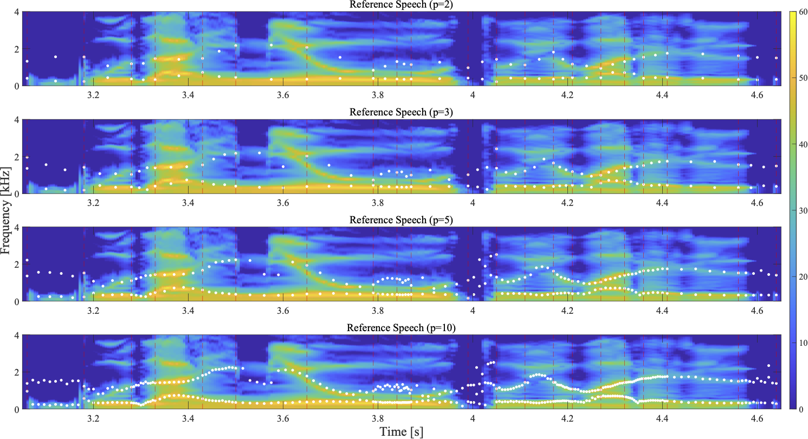
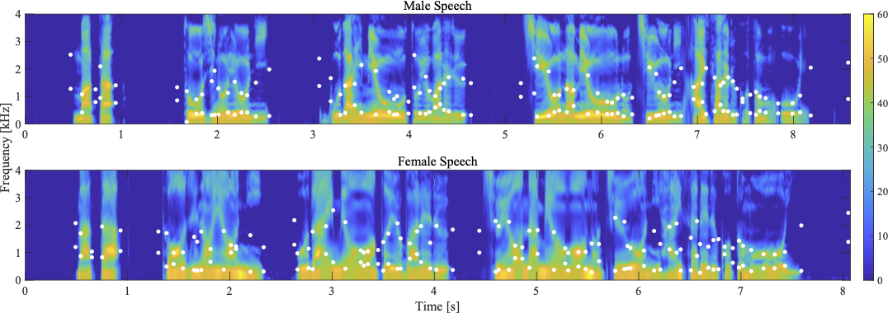

明治大学[森勢研究室](http://www.isc.meiji.ac.jp/~mmorise/lab/)にて[堀部貴紀](https://takanohori.github.io/)が行っている音声モーフィングの研究についてまとめています．

## 音声モーフィングにおける時間軸方向の対応点数が品質に与える影響  
**堀部貴紀**, 森勢将雅, 河原英紀, 日本音響学会2022年秋季研究発表会 (発表日：2023/03/17予定).

### アブストラクト
- 音声モーフィングにおける対応点の時間軸方向に着目し，各音素区間における対応点数が品質にどのような影響を与えるか評価した．
- **音素境界の対応点のみで合成されたモーフィング音声**をリファレンス，**各音素区間の対応点数が2点，3点，5点，10点のモーフィング音声**を音刺激として，より人間らしく自然であるかという基準で5段階評価した．
- CMOSで評価したところ,時間軸方向での増加は品質改善には寄与せず，対応点数の増加に伴い，品質の低下が確認された．

- **MM/FF/MF**: 音声モーフィングに使用した音声の性別の組み合わせ
<table>
<tbody align="center" width="80%">
    <tr>
        <td></td>
        <td><b>p=2</b></td>
        <td><b>p=3</b></td>
        <td><b>p=5</b></td>
        <td><b>p=10</b></td>
    </tr>
    <tr>
        <td><b>FF</b></td>
        <td><audio src="data/morphRefjvs040Tarjvs082P2T010.wav" controls></audio></td>
        <td><audio src="data/morphRefjvs040Tarjvs082P3T010.wav" controls></audio></td>
        <td><audio src="data/morphRefjvs040Tarjvs082P5T010.wav" controls></audio></td>
        <td><audio src="data/morphRefjvs040Tarjvs082P10T010.wav" controls></audio></td>
    </tr>
    <tr>
        <td><b>MM</b></td>
        <td><audio src="data/morphRefjvs009Tarjvs087P2T010.wav" controls></audio></td>
        <td><audio src="data/morphRefjvs009Tarjvs087P3T010.wav" controls></audio></td>
        <td><audio src="data/morphRefjvs009Tarjvs087P5T010.wav" controls></audio></td>
        <td><audio src="data/morphRefjvs009Tarjvs087P10T010.wav" controls></audio></td>
    </tr>
    <tr>
        <td><b>MF</b></td>
        <td><audio src="data/morphRefjvs040Tarjvs087P2T010.wav" controls></audio></td>
        <td><audio src="data/morphRefjvs040Tarjvs087P3T010.wav" controls></audio></td>
        <td><audio src="data/morphRefjvs040Tarjvs087P5T010.wav" controls></audio></td>
        <td><audio src="data/morphRefjvs040Tarjvs087P10T010.wav" controls></audio></td>
    </tr>
</tbody>
</table>

## 自動推定された音素境界とフォルマントによる音声モーフィングの品質評価  
**堀部貴紀**, 森勢将雅, 河原英紀, 日本音響学会2022年秋季研究発表会 (発表日：2022/09/15). [[発表資料](ASJ2022A_poster_published.pdf)]

### アブストラクト
- [WORLD](http://www.isc.meiji.ac.jp/~mmorise/world/index.html)をベースとした音声モーフィングにおいて，時間軸に音素境界， 周波数軸にフォルマント周波数を対応点の設定に用いた音声モーフィング手法について検討した.
- [Juliusによる自動音素アライメント](https://julius.osdn.jp/index.php?q=ouyoukit.html)で得られる音素境界を中心に切り出したフレームに対して，線形予測符号によるフォルマント推定手法を用いる．
- 提案手法の妥当性を評価するため，対応点を手動設定して作成したモーフィング音声との自然性に関する主観評価実験を実施した．
- 手動設定されたモーフィング音声と比較したところ，自動設定されたモーフィング音声でも40%程度は同等の品質であることが示唆された．

- **Manual**: 著者が morphingAligner (注1)を用いて手動で対応づけした音源
- **Auto**: 提案手法による対応点の自動設定された音源
- **MM/FF/MF**: 音声モーフィングに使用した音声の性別の組み合わせ
<table>
<tbody align="center" width="50%">
    <tr>
        <td></td>
        <td><b>Manual</b></td>
        <td><b>Auto (proposed Method)</b></td>
    </tr>
    <tr>
        <td><b>FF</b></td>
        <td><audio src="data/m_jvs040vs082_t010.wav" controls></audio></td>
        <td><audio src="data/a_jvs040vs082_t010.wav" controls></audio></td>
    </tr>
    <tr>
        <td><b>MM</b></td>
        <td><audio src="data/m_jvs009vs087_t010.wav" controls></audio></td>
        <td><audio src="data/a_jvs009vs087_t010.wav" controls></audio></td>
    </tr>
    <tr>
        <td><b>MF</b></td>
        <td><audio src="data/m_jvs082vs087_t010.wav" controls></audio></td>
        <td><audio src="data/a_jvs082vs087_t010.wav" controls></audio></td>
    </tr>
</tbody>
</table>

注1: 河原英紀 他,「音声分析合成基盤WORLDのGUI実装と見えてきた課題」, 信学技報, Vol.122, No.81, SP2022--2, pp.3--6 (2022).